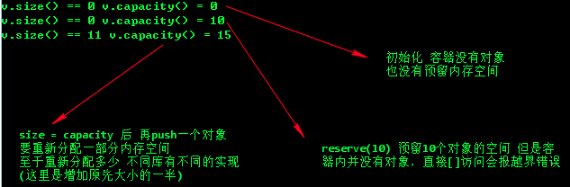

# CMakeList


Example:

```c++
cmake_mini_required(VERSION 3.4.1)  #定义cmake 支持的版本
 
project(my_proj)  #项目名
 
include_directories(include)  #头文件路径
 
aux_source_directory(src DIR_SOURCE) #源文件目录，DIR_SOURCE 为定义的变量
 
set(SRC_FILE_PATH ${DIR_SOURCE})  #设置环境变量，编译用到的源文件都要放到这里
 
add_executable(my_proj ${SRC_FILE_PATH})  #设置可执行源文件编译成的可执行文件名
```



# STL


## Map


## Vector


```c++
#include <vector>

vector<int> vec; 
```

- **push_back( )** 成员函数在向量的**末尾插入值**，如果有必要会**扩展**向量的大小。
- **size( )** 函数显示向量的大小。
- **begin( )** 函数返回一个指向向量开头的**迭代器**。
- **end( )** 函数返回一个指向向量末尾的**迭代器**。


### capacity 和 size 属性区别

**size** 是当前 vector 容器 ***真实占用*** 的大小，也就是容器当前拥有多少个容器。

**capacity** 是指在发生 realloc 前能允许的最大元素数，即 ***预分配*** 的内存空间。

当然，这两个属性分别对应两个方法：**resize()** 和 **reserve()**。

使用 **resize()** 容器内的对象内存空间是真正存在的。

使用 **reserve()** 仅仅只是修改了 capacity 的值，容器内的对象并没有真实的内存空间(空间是"野"的)。

此时切记使用 **[]** 操作符访问容器内的对象，很可能出现数组越界的问题。

```c++
#include <iostream>
#include <vector>

using std::vector;
int main(void)
{
    vector<int> v;
    std::cout<<"v.size() == " << v.size() << " v.capacity() = " << v.capacity() << std::endl;
    v.reserve(10);
    std::cout<<"v.size() == " << v.size() << " v.capacity() = " << v.capacity() << std::endl;
    v.resize(10);
    v.push_back(0);
    std::cout<<"v.size() == " << v.size() << " v.capacity() = " << v.capacity() << std::endl;

    return 0;
}
```


# JSON


# Binary