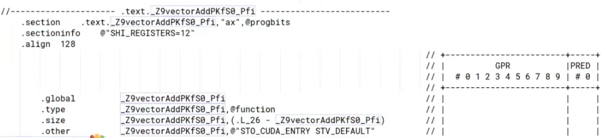
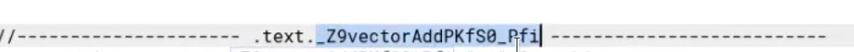
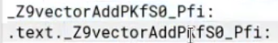
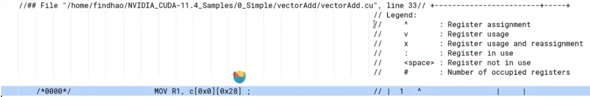
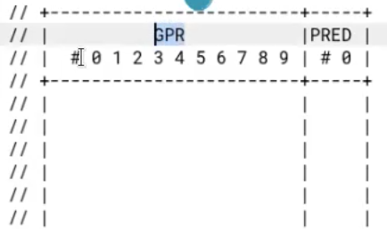
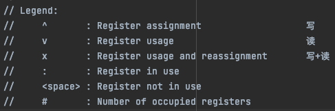
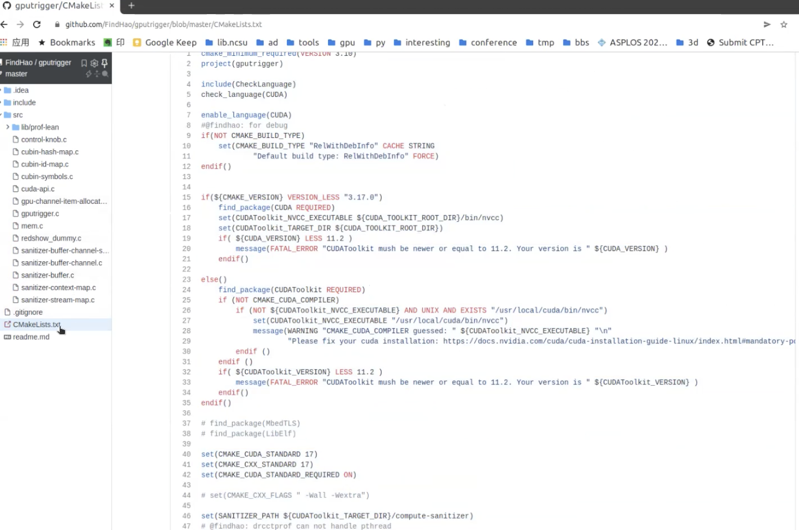

# April

## vectoradd.txt

### 属性参数






text 域	kernal(function) 名

kernal - 数据并行处理函数（核函数), 在GPU上执行的程序，一个Kernel对应一个Grid

https://zhuanlan.zhihu.com/p/143858869	Cuda kernel


  function name -> 12 个寄存器


### 汇编行

#### 任务1

 function name, 可作为解析时识别标准




非注释部分属于源文件 vectorAdd.cu line 33 被翻译成的汇编

```
/*0000*/                   MOV R1, c[0x0][0x28] ;
```

​	相对 function 地址的偏移量			gpu汇编

​	目标：通过 offset 查汇编

​	

#### 	任务 2



GPR  通用寄存器 General Purpose Register 	0 - 9 是寄存器序号

一个 Pred 寄存器





# May 12

提问：




binary文件


进度：

1. 建repo
2. 熟悉 CLion , CMake, Lib 打包，file 读写解析
3. 复盘学长录屏讲解
4. 跑了几个基本的 project