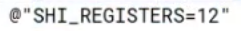
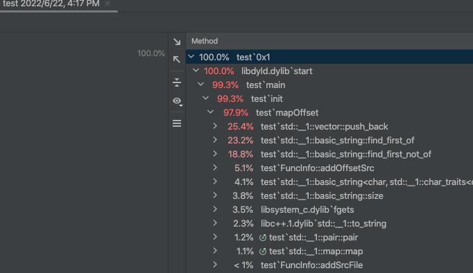

# April

## vectoradd.txt

### 属性参数


text 域	kernal(function) 名

kernal - 数据并行处理函数（核函数), 在GPU上执行的程序，一个Kernel对应一个Grid

https://zhuanlan.zhihu.com/p/143858869	Cuda kernel


  function name -> 12 个寄存器


### 汇编行

#### 任务1

 function name, 可作为解析时识别标准


非注释部分属于源文件 vectorAdd.cu line 33 被翻译成的汇编

```
/*0000*/                   MOV R1, c[0x0][0x28] ;
```

​	相对 function 地址的偏移量			gpu汇编

​	目标：通过 offset 查汇编

​	

#### 	任务 2


GPR  通用寄存器 General Purpose Register 	0 - 9 是寄存器序号

一个 Pred 寄存器


* 推断数组类型	15:00左右

  通过寄存器使用情况	可能需要循环


May 26


没有出现 //## File 


list 哪些是float 哪些是int

enum 或 define 

给指令编码 通过index来查	（比如 < 1000 是 int）


问题：

☑️ 对象数组需不需要换成map方便索引

getFunctionName 仍有bug

☑️ 需要动态识别出寄存器的不同个数吗，还是写死就行

☑️ 表格中每个数字的出现index不同，代码需要应对不同表格吗，还是根据不同表名写死即可

寄存器用vector，那么查询哪个寄存器正在使用岂不效率很低（或是通过code中R3查询）

enum string 需要转换？


```
@!P6 IADD3 R4, R4, 0x1, RZ ;
```

第一个就不是函数了

判断是不是@开头


cuda binary.doc

enum / map  取代 vector?


real    0m35.266s

real    0m28.210s

real    0m25.291s

real    0m23.316s

real    0m22.546s

real    0m20.808s

real    0m14.782s

real    0m2.168s

real    0m1.228s

real    0m0.497s


Castro.txt

real    1m16.720s

real    0m27.366s

real    0m17.812s

real    0m8.379s


# Debug 记录


github 上传大文件出错

新建对象分配在栈区出错，应改成堆区

编译时用成debug模式速度慢，应改为release模式

Clion profiler 优化

正则表达式太慢		

并行计算 OpenMP。 （更慢了）

```c++
                 // Analyze line by line
    FuncInfo *FI = nullptr;
//    map<string, FuncInfo> map_FuncInfos; // function name -> FuncInfo Objects
//    vector<FuncInfo> vec_FuncInfos;

    string filePath = "no src file";
    string fileLine = "-1";
    int reg_GPR_size = -1;
    int reg_PRED_size = -1;
    int reg_UGPR_size = -1;
    int reg_UPRED_size = -1;
    while (getline(myfile, tempStr)) {  // 文件整个先读进memory(ifstream stringstream)   切割不同 kernel function，每一块作为input传进： while换成function -》 参数
        if (tempStr.empty())
            continue;
        tempStr.erase(0, tempStr.find_first_not_of(" \t"));   // find_first_of("/")       不用erase 不新建字符串 substr
        if (tempStr[0] == '.')
            continue;
        // if (tempStr[0] == '/' && tempStr.find("#") == tempStr.npos)

        if (tempStr[1] == '*' && tempStr[0] == '/') {    // if (tempStr.find("/*") != tempStr.npos)
            // match offset and assembly code
//            vector<string> offset_code = getMatch("/\\*(.*)\\*/( +)(.*); (.*)\\/\\/ \\|\\s*(.*)\\|\\s*(.*)\\|\\s*(.*)\\|\\s*(.*)\\|", tempStr);
//            if (!offset_code.empty()) {
//            }

            FI->addSrcFile(filePath, fileLine);     //解决没有源文件情形，不知道为什么加在前面会报139错

            int offset = hexToInt(tempStr.substr(2, tempStr.find("*/") - 2));       // 注意 find 和 find_first_of 的区别

            // erase 汇编代码之前所有内容
            tempStr.erase(0, tempStr.find_first_of(" "));
            tempStr.erase(0, tempStr.find_first_not_of(" "));

            string code = tempStr.substr(0, tempStr.find_first_of(";"));
            //outfile << "Offset: " << offset << "       Assembly Code: " << code << "\n";

            // erase 寄存器个数之前所有内容
            tempStr.erase(0, tempStr.find_first_of("//"));
            tempStr.erase(0, tempStr.find_first_of("|") + 1);
            tempStr.erase(0, tempStr.find_first_not_of(" "));

            // construct register
            auto *reg_GPR = new Register();
            reg_GPR->size = reg_GPR_size;
            reg_GPR->name = "GPR";
            auto *reg_PRED = new Register();
            reg_PRED->size = reg_PRED_size;
            reg_PRED->name = "PRED";
            auto *reg_UGPR = new Register();
            reg_UGPR->size = reg_UGPR_size;
            reg_UGPR->name = "UGPR";
            auto *reg_UPRED = new Register();
            reg_UPRED->size = reg_UPRED_size;
            reg_UPRED->name = "UPRED";
            //vector<string> reg_status = getMatch("(.*)\\/\\/ \\|\\s*(.*)\\|\\s*(.*)\\|\\s*(.*)\\|\\s*(.*)\\|", tempStr);  // (.*)\/\/ \|\s*(.*)\|\s*(.*)\|    \s* 取代空格
            string str_GPR = tempStr.substr(0, tempStr.find_first_of("|"));
            tempStr.erase(0, tempStr.find_first_of("|") + 1);
            tempStr.erase(0, tempStr.find_first_not_of(" "));

            string str_PRED = tempStr.substr(0, tempStr.find_first_of("|"));
            tempStr.erase(0, tempStr.find_first_of("|") + 1);
            tempStr.erase(0, tempStr.find_first_not_of(" "));

            string str_UGPR = "";
            string str_UPRED = "";
            int tempPos = tempStr.find_first_of("|");
            if (tempPos != tempStr.npos) {
                str_UGPR = tempStr.substr(0, tempPos);
                tempStr.erase(0, tempPos + 1);
                tempStr.erase(0, tempStr.find_first_not_of(" "));

                tempPos = tempStr.find_first_of("|");
                if (tempPos != tempStr.npos) {
                    str_UPRED = tempStr.substr(0, tempStr.find_first_of("|"));
                }
            }


            if (str_GPR.empty()) {  // no reg_GPR used now
                reg_GPR->occupied_count = 0;
                vector<int> reg_s(reg_GPR->size, 0);
                reg_GPR->reg_status = reg_s;
                //cout << "GPR empty" << endl;
            } else {
                int index = str_GPR.find(' ') - 1;  // active number 的末位
                reg_GPR->occupied_count = atoi(str_GPR.substr(0,index + 1).c_str());
                //cout << "GPR occupied_count: " << reg_GPR->occupied_count << endl;
                for (int i = 0; i < reg_GPR->size; i++) {
                    index = index + 1 + to_string(i).size();
                    //cout << str_GPR[index] << endl;
                    switch (str_GPR[index]) {
                        case ' ':
                            reg_GPR->reg_status.push_back(0);
                            break;
                        case '^':
                            reg_GPR->reg_status.push_back(1);
                            break;
                        case 'v':
                            reg_GPR->reg_status.push_back(2);
                            break;
                        case 'x':
                            reg_GPR->reg_status.push_back(3);
                            break;
                        case ':':
                            reg_GPR->reg_status.push_back(4);
                            break;
                        default:
                            cout << "Error: Unidentify: " << str_GPR[index] << endl;
                            cout << "FuncName: " << FI->getFuncName() << endl;
                            cout << "Offset: " << offset << endl;
                            cout << "Code: " << code << endl;
                            exit(0);
                    }
                }
            }

            if (str_PRED.empty()) {  // no reg_PRED used now
                reg_PRED->occupied_count = 0;
                vector<int> reg_s(reg_PRED->size, 0);
                reg_PRED->reg_status = reg_s;
            } else {
                int index = str_PRED.find(' ') - 1;  // active number 的末位
                reg_PRED->occupied_count = atoi(str_PRED.substr(0,index + 1).c_str());
                for (int i = 0; i < reg_PRED->size; i++) {
                    index = index + 1 + to_string(i).size();
                    switch (str_PRED[index]) {
                        case ' ':
                            reg_PRED->reg_status.push_back(0);
                            break;
                        case '^':
                            reg_PRED->reg_status.push_back(1);
                            break;
                        case 'v':
                            reg_PRED->reg_status.push_back(2);
                            break;
                        case 'x':
                            reg_PRED->reg_status.push_back(3);
                            break;
                        case ':':
                            reg_PRED->reg_status.push_back(4);
                            break;
                        default:
                            cout << "Error: Unidentify:" << str_PRED[index] << endl;
                    }
                }
            }

            if (str_UGPR.empty()) {  // no reg_UGPR used now
                reg_UGPR->occupied_count = 0;
                vector<int> reg_s(reg_UGPR->size, 0);
                reg_UGPR->reg_status = reg_s;
            } else {
                int index = str_UGPR.find(' ') - 1;  // active number 的末位
                reg_UGPR->occupied_count = atoi(str_UGPR.substr(0,index + 1).c_str());
                for (int i = 0; i < reg_UGPR->size; i++) {
                    index = index + 1 + to_string(i).size();
                    switch (str_UGPR[index]) {
                        case ' ':
                            reg_UGPR->reg_status.push_back(0);
                            break;
                        case '^':
                            reg_UGPR->reg_status.push_back(1);
                            break;
                        case 'v':
                            reg_UGPR->reg_status.push_back(2);
                            break;
                        case 'x':
                            reg_UGPR->reg_status.push_back(3);
                            break;
                        case ':':
                            reg_UGPR->reg_status.push_back(4);
                            break;
                        default:
                            cout << "Error: Unidentify:" << str_UGPR[index] << endl;
                    }
                }
            }

            if (str_UPRED.empty()) {  // no reg_UPRED used now
                reg_UPRED->occupied_count = 0;
                vector<int> reg_s(reg_UPRED->size, 0);
                reg_UPRED->reg_status = reg_s;
            } else {
                int index = str_UPRED.find(' ') - 1;  // active number 的末位
                reg_UPRED->occupied_count = atoi(str_UPRED.substr(0,index + 1).c_str());
                for (int i = 0; i < reg_UPRED->size; i++) {
                    index = index + 1 + to_string(i).size();
                    switch (str_UPRED[index]) {
                        case ' ':
                            reg_UPRED->reg_status.push_back(0);
                            break;
                        case '^':
                            reg_UPRED->reg_status.push_back(1);
                            break;
                        case 'v':
                            reg_UPRED->reg_status.push_back(2);
                            break;
                        case 'x':
                            reg_UPRED->reg_status.push_back(3);
                            break;
                        case ':':
                            reg_UPRED->reg_status.push_back(4);
                            break;
                        default:
                            cout << "Error: Unidentify:" << str_UPRED[index] << endl;
                    }
                }
            }

            //  add to the object
            FI->addOffsetSrc(offset, filePath, fileLine, code, reg_GPR, reg_PRED, reg_UGPR, reg_UPRED);

            continue;

        } else if (tempStr[2] == '-') {
            // match function name
//            vector<string> function_name = getMatch("//-+ \\.text\\.(.*) -+", tempStr);
//            if (!function_name.empty()) {   // match 到 function 了
//            }

            if (FI != nullptr) {
                //vec_FuncInfos.push_back(*FI);
                if (map_FuncInfos.find(FI->getFuncName()) != map_FuncInfos.end())
                    cout << "ERROR: Kernel Exists!" << endl;
                map_FuncInfos.insert(pair<string, FuncInfo>(FI->getFuncName(), *FI));
                //cout << "test: " << map_FuncInfos[FI->getFuncName()].getFuncName() << endl;
            }

            tempStr.erase(0, tempStr.find_first_of("."));
            string kernel_str = tempStr.substr(6, tempStr.find_first_of(" ---") - 6);
            FuncInfo *tempObj = new FuncInfo(kernel_str);  // 改存 stack 为 heap
            FI = tempObj;
            filePath = "no src file";
            fileLine = "-1";

            reg_GPR_size = -1;
            reg_PRED_size = -1;
            reg_UGPR_size = -1;
            reg_UPRED_size = -1;
            //FI->addSrcFile(filePath, fileLine);       //报139错

            cout << "Create: " << FI->getFuncName() << endl;
            continue;

        } else if (tempStr[2] == '#' && tempStr[1] == '/') {
            // match src file and corresponding line
            tempStr.erase(0, tempStr.find_first_of("\"") + 1);
            filePath = tempStr.substr(0, tempStr.find_first_of("\""));

            tempStr.erase(0, tempStr.find(", line") + 6);
            tempStr.erase(0, tempStr.find_first_not_of(" "));
            fileLine = tempStr.substr(0, tempStr.find_first_of(" "));

//            cout << "   Source File    Name: " << filePath << "       Line: " << fileLine << endl;
            FI->addSrcFile(filePath, fileLine);

            continue;
        }else if (tempStr.find("#") != tempStr.npos && tempStr.find("// |") != tempStr.npos) {
            // count each register

            tempStr.erase(0, tempStr.find_first_of("#") + 1);
            reg_GPR_size = regCount(tempStr.substr(0, tempStr.find_first_of("|")));

            tempStr.erase(0, tempStr.find_first_of("#") + 1);
            reg_PRED_size = regCount(tempStr.substr(0, tempStr.find_first_of("|")));

            int tempPos = tempStr.find_first_of("#");
            if (tempPos != tempStr.npos) {
                tempStr.erase(0, tempPos + 1);
                reg_UGPR_size = regCount(tempStr.substr(0, tempStr.find_first_of("|")));

                tempPos = tempStr.find_first_of("#");
                if (tempPos != tempStr.npos) {
                    tempStr.erase(0, tempStr.find_first_of("#") + 1);
                    reg_UPRED_size = regCount(tempStr.substr(0, tempStr.find_first_of("|")));
                } else {
                    reg_UPRED_size = 0;
                }
            } else {
                reg_UGPR_size = 0;
            }
            //cout << "reg_GPR_size: " << reg_GPR_size << endl;
            //cout << "reg_PRED_size: " << reg_PRED_size << endl;
            //cout << "reg_UGPR_size: " << reg_UGPR_size << endl;
            //cout << "reg_UPRED_size: " << reg_UPRED_size << endl;

        } else {
            // match src file and corresponding line
//            vector<string> src_file = getMatch("(\\t*)\\/\\/## File \"(.*)\", line ([0-9]*)(.*)", tempStr);     //补上 else 排除
//            if (!src_file.empty()) {
//                filePath = src_file[1];
//                fileLine = src_file[2];
//                cout << "   Source File    Name: " << filePath << "       Line: " << fileLine << endl;
//                FI->addSrcFile(filePath, fileLine);
//
//                continue;
//            }


            // count each register          // 写进function的else
//            vector<string> reg_count = getMatch("(.*)\\/\\/ \\|\\s*#(.*)\\s+\\|\\s*#(.*)\\s+\\|\\s*#(.*)\\s+\\|\\s*#(.*)\\s+\\|", tempStr);
//            if (!reg_count.empty()) {
//                reg_GPR_size = regCount(reg_count[1]);
//                //cout << "reg_GPR_size: " << reg_GPR_size << endl;
//                reg_PRED_size = regCount(reg_count[2]);
//                //cout << "reg_PRED_size: " << reg_PRED_size << endl;
//                reg_UGPR_size = regCount(reg_count[3]);
//                //cout << "reg_UGPR_size: " << reg_UGPR_size << endl;
//                reg_UPRED_size = regCount(reg_count[4]);
//                //cout << "reg_UPRED_size: " << reg_UPRED_size << endl;
//
//                continue;
//            }
        }

    }
    
    if (FI != nullptr) {
        //vec_FuncInfos.push_back(*FI);
        map_FuncInfos.insert(pair<string, FuncInfo>(FI->getFuncName(), *FI));
    }
       
```


```c++
    // Show result (map)
    /*
    cout << endl << "map_FuncInfos size: " << map_FuncInfos.size() << endl;
    for (auto iter : map_FuncInfos) {
        string funcName = iter.second.getFuncName();
        cout << "Function Name: " << funcName << endl;
        //iter.second.printOffset();
//        for (auto iter1 : iter.second.getOffsetSrc()) {
//            cout << "Offset: " << iter1.first << "  Code: " << *iter1.second.code << endl;
//        }
        map_FuncInfos[funcName].searchOffset(0);
        cout << endl;
    }
     */


//    cout << "vec_FuncInfos size: " << vec_FuncInfos.size() << endl;
//
//    for (int i = 0; i < vec_FuncInfos.size(); i++) {
//        cout << vec_FuncInfos[i].getFuncName() << endl;
//        //vec_FuncInfos[i].printSrcFile();          // Print source file and line
//        //vec_FuncInfos[i].printOffset();           // Print mappings
//        vec_FuncInfos[i].searchOffset(32);       // Test search offset
//    }
```


继续优化

以文件形式写出来

map set  怎么导出


# 优化过程总结

* 通过特殊标志符识别，尽可能避免无谓的 regex 匹配
  * castro.head.10000.txt 运行时间变化：35s -> 15s。增速超过 50%

* 通过 profiler 发现 regex 耗时占比大于90%，因此将所有 regex 过程改为基于 string 的解析过程
  * castro.head.10000.txt 运行时间变化：15s -> 0.5s。增速超过 30倍
* 通过多线程（并行计算 OpenMP）
  * 效果不佳，取消

* 通过 profiler 发现 getline 耗时占比75%，考虑从 getline 入手
  * 建立 buffer，增快 getline 速度：收效甚微
  * 将 getline 改为 <stdio.h> 中的 fgets() 方法，castro.txt 运行时间由大于 8s 改进至小于 4s，增速超过 50%。profiler前后对比如下：
    * 


# Protobuf


g++ -std=c++11 -o protobufTest.out -lprotobuf test.cpp student.pb.cc 解决

```bash
$ protoc mapRes.proto --cpp_out=./
$ g++ -std=c++11 -o mapTest.out -lprotobuf maps.cpp mapRes.pb.cc
./mapTest.out 
```


https://www.cnblogs.com/tangxin-blog/p/8314563.html	map 用法


decode search 分离问题

遇到 LEA MOV		FSEL